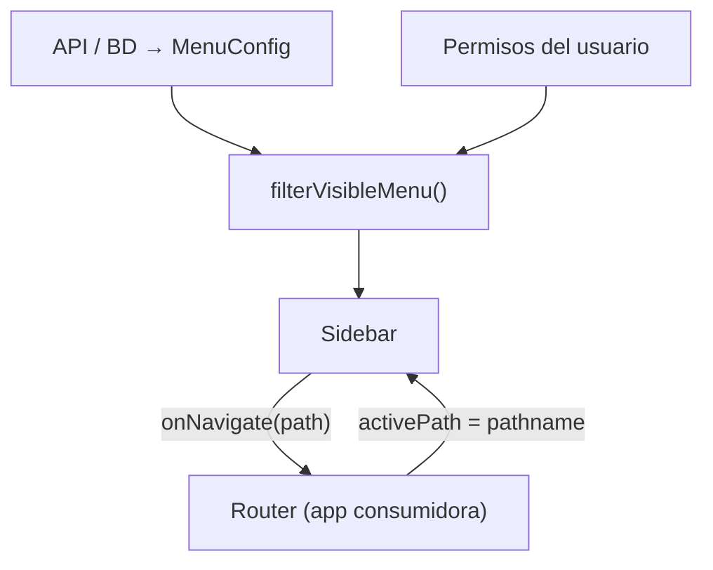

# Sidebar

Componente de navegación lateral para aplicaciones empresariales. Recibe el menú desde tu API o base de datos, filtra ítems por permisos (RBAC), soporta hasta **3 niveles** de profundidad, temas personalizables e integración con cualquier router.

::: tip Integración
El Sidebar **no incluye router**. Tu aplicación conecta `activePath` y `onNavigate` con React Router u otro sistema. Ver [Integración con routing](/guide/routing).
:::

## Importación

```tsx
import { Sidebar, sidebarThemes } from 'glubox';
import type {
  SidebarProps,
  MenuConfig,
  MenuItem,
  MenuSubItem,
  SidebarTheme,
  IconResolver,
  SidebarBrandComponent,
} from 'glubox';
import 'glubox/style.css';
```

## Props

| Prop | Tipo | Default | Descripción |
|------|------|---------|-------------|
| `menu` | `MenuConfig` | — | Estructura del menú (API/BD). **Requerido.** |
| `userPermissions` | `Permission[]` | — | Permisos del usuario autenticado. **Requerido.** |
| `activePath` | `string` | — | Ruta activa actual (desde el router). Resalta ítem y ancestros. |
| `onNavigate` | `(path: string) => void` | — | Callback al hacer clic en un ítem con `path`. |
| `collapsed` | `boolean` | `false` | Sidebar en modo rail (solo iconos). |
| `width` | `number \| string` | `240px` | Ancho expandido; en colapsado suele usarse `64`. |
| `onCollapsedChange` | `(collapsed: boolean) => void` | — | Al pulsar el botón contraer/expandir. |
| `showCollapseButton` | `boolean` | `true` si hay `onCollapsedChange` | Muestra u oculta el botón de colapsar. |
| `theme` | preset \| `SidebarTheme` | hereda global | Sin prop sigue `data-theme` / `data-mode`. Override: `light`, `dark`, `modern-dark`, … |
| `renderIcon` | `IconResolver` | — | Resuelve iconos del menú por nombre (Lucide, Iconify, etc.). |
| `brand` | `SidebarBrandComponent` | — | Componente de logo / nombre de empresa. |
| `collapseOthersOnSelect` | `boolean` | `false` | Acordeón al **expandir/contraer** módulos de nivel 1. |
| `collapseOnNavigate` | `boolean` | `false` | Al **navegar**, sincroniza y puede cerrar módulos abiertos. |

### Comportamiento de expansión

| Escenario | `collapseOthersOnSelect` | `collapseOnNavigate` |
|-----------|--------------------------|----------------------|
| Clic en chevron de otro módulo | Cierra los demás módulos | — |
| Clic en Ajustes / Ayuda (sin hijos) | No afecta | No cierra menús abiertos |
| Navegar a `/facturacion/facturas/emitir` | — | Solo abre ancestros; no cierra otros |
| Navegar con ambas props en `true` | — | Deja abiertos solo los ancestros de la ruta |

Los ítems de **bottom** (`Ajustes`, `Ayuda`) nunca provocan cierre de módulos aunque `collapseOnNavigate` esté activo.

## Arquitectura



1. El backend entrega `MenuConfig` con `path`, `permissions`, `children`, etc.
2. El Sidebar filtra ítems según `userPermissions` (regla OR).
3. La app conecta clics con el router y devuelve la ruta activa.

## Modelo de menú

Contrato completo en [Esquema del menú (API)](/guide/menu-api).

### Niveles

| Nivel | Rol | `path` | Comportamiento |
|-------|-----|--------|----------------|
| 1 — **Módulo** | Sección principal | Opcional (inicio del módulo) | Icono, posición top/bottom, puede tener hijos |
| 2 — **Opción** | Agrupador | Opcional | Solo expande; navega si tiene `path` |
| 3 — **Acción** | Pantalla final | **Requerido** | Navega al hacer clic |

### Módulo con página de inicio

Si un módulo tiene `path` **y** `children`, el clic en el **nombre** navega y el **chevron** expande/contrae por separado:

```json
{
  "id": "facturacion",
  "label": "Facturación",
  "icon": "receipt",
  "path": "/facturacion",
  "permissions": ["facturacion:read"],
  "children": [ "..."]
}
```

### Posiciones

- `position: "top"` (default) — lista principal, scrollable.
- `position: "bottom"` — fijado al pie (Ajustes, Ayuda, perfil).

### Ejemplo simplificado (Facturación SRI)

```json
{
  "items": [
    {
      "id": "facturacion",
      "label": "Facturación",
      "icon": "receipt",
      "path": "/facturacion",
      "permissions": ["facturacion:read"],
      "children": [
        {
          "id": "facturacion-facturas",
          "label": "Facturas",
          "permissions": ["facturacion:facturas:read"],
          "children": [
            {
              "id": "facturacion-facturas-emitir",
              "label": "Emitir",
              "path": "/facturacion/facturas/emitir",
              "permissions": ["facturacion:facturas:emitir"]
            }
          ]
        }
      ]
    },
    {
      "id": "ajustes",
      "label": "Ajustes",
      "icon": "settings",
      "path": "/ajustes",
      "permissions": ["ajustes:read"],
      "position": "bottom"
    }
  ]
}
```

## RBAC (permisos)

Reglas aplicadas por `filterVisibleMenu`:

| Caso | Visible |
|------|---------|
| Ítem sin `permissions` | Sí, para todos |
| Ítem con `permissions: ["a", "b"]` | Sí si el usuario tiene **al menos uno** (OR) |
| Opción/módulo con hijos | Solo si queda **al menos un hijo visible** |
| Hijo sin permiso | Se oculta; si todos los hijos se ocultan, el padre también |

```tsx
const visibleMenu = filterVisibleMenu(menu, userPermissions);
// El Sidebar aplica esto internamente; puedes usar la misma función
// en guards de ruta para coherencia UI ↔ URL.
```

::: warning URL directa
Ocultar un ítem en el Sidebar **no impide** escribir la URL manualmente. Valida permisos también en el router o en el backend. Ver [Routing](/guide/routing#guard-de-permisos).
:::

## Iconos

### Iconos del menú (`renderIcon`)

El paquete **no incluye Lucide** ni otras librerías. Los nombres de icono vienen de tu API (`"receipt"`, `"settings"`, etc.) y los resuelves con `renderIcon`:

```tsx
import { Circle, Receipt, Settings, type LucideIcon } from 'lucide-react';
import type { IconResolver } from 'glubox';

const registry: Record<string, LucideIcon> = {
  receipt: Receipt,
  settings: Settings,
};

export const renderMenuIcon: IconResolver = (name, className) => {
  const Icon = registry[name] ?? Circle;
  return <Icon className={className} aria-hidden />;
};
```

El Sidebar aplica la clase `sidebar__icon`; el tamaño lo controla el CSS (incluido modo colapsado).

### Iconos integrados (UI)

Estos nombres los resuelve el propio Sidebar; **no** hace falta registrarlos en `renderIcon`:

| Nombre | Uso |
|--------|-----|
| `chevron-down` | Expandir submenús |
| `panel-left-close` | Contraer sidebar |
| `panel-left-open` | Expandir sidebar |

Si no pasas `renderIcon` y el icono del menú no es built-in, se muestra un fallback con la inicial del nombre.

## Marca (`brand`)

Componente React que recibe `{ collapsed: boolean }`:

```tsx
import type { SidebarBrandProps } from 'glubox';

export function AppBrand({ collapsed }: SidebarBrandProps) {
  return (
    <div style={{ display: 'flex', alignItems: 'center', gap: 8 }}>
      
      {!collapsed && <span>Mi Empresa</span>}
    </div>
  );
}

<Sidebar brand={AppBrand} {...props} />
```

## Temas

Sin prop `theme`, el Sidebar hereda `data-theme` / `data-mode` del documento (recomendado).

### Override con presets

```tsx
<Sidebar theme="dark" {...props} />
<Sidebar theme="modern-light" {...props} />
```

### Tema personalizado

```tsx
import type { SidebarTheme } from 'glubox';

const corporate: SidebarTheme = {
  background: '#0f172a',
  text: '#f8fafc',
  icon: '#94a3b8',
  hoverBackground: 'rgba(255,255,255,0.06)',
  activeBackground: 'rgba(255,255,255,0.06)',
  activeText: '#38bdf8',
  activeIcon: '#38bdf8',
  mutedText: '#64748b',
  treeLine: 'rgba(255,255,255,0.1)',
  railActive: '#38bdf8',
};

<Sidebar theme={corporate} {...props} />
```

Tokens disponibles en `SidebarTheme`:

| Token | Descripción |
|-------|-------------|
| `background` | Fondo del sidebar |
| `text` | Texto principal |
| `icon` | Color de iconos |
| `hoverBackground` | Fondo al hover |
| `activeText` / `activeIcon` | Ítem activo |
| `mutedText` | Opciones y acciones secundarias |
| `treeLine` | Líneas del árbol de submenús |
| `railActive` | Barra lateral del ítem activo |
| `iconFallbackBackground` | Fondo del fallback de icono |

Presets exportados: `sidebarThemes` con `light`, `dark`, `modern-light`, `modern-dark`, `enterprise-light`, `enterprise-dark`.

Temas globales CSS: [Guía de temas](/guide/themes).

## Jerarquía visual

| Nivel | Estilo |
|-------|--------|
| Módulo | Semibold, icono; rail si hay descendiente activo |
| Opción | Texto muted, línea guía; sin fondo al abrir |
| Acción activa | Rail + color accent; única hoja resaltada |

En modo **colapsado** (`collapsed={true}`):

- Solo se muestran iconos de módulos e ítems de bottom.
- Los submenús se ocultan.
- Los iconos se centran en el rail (~22px).

## Uso completo con router

```tsx
import { useState } from 'react';
import { useLocation, useNavigate } from 'react-router-dom';
import { Sidebar } from 'glubox';
import 'glubox/style.css';

export function AppLayout({ menu, userPermissions, brand, renderIcon }) {
  const [collapsed, setCollapsed] = useState(false);
  const navigate = useNavigate();
  const { pathname } = useLocation();

  return (
    <div style={{ display: 'flex', minHeight: '100vh' }}>
      <Sidebar
        menu={menu}
        userPermissions={userPermissions}
        activePath={pathname}
        onNavigate={navigate}
        collapsed={collapsed}
        width={collapsed ? 64 : 240}
        onCollapsedChange={setCollapsed}
        collapseOthersOnSelect
        renderIcon={renderIcon}
        brand={brand}
        theme="dark"
      />
      {/* <Outlet /> o children */}
    </div>
  );
}
```

Guía detallada: [Integración con routing](/guide/routing).

## TypeScript — tipos exportados

```tsx
import type {
  SidebarProps,
  MenuConfig,
  MenuItem,
  MenuSubItem,
  MenuItemPosition,
  Permission,
  IconResolver,
  IconName,
  SidebarBrandProps,
  SidebarBrandComponent,
  SidebarTheme,
  SidebarThemePreset,
  SidebarThemeInput,
} from 'glubox';
```

## Checklist de implementación

1. Instalar `glubox` e importar `glubox/style.css`.
2. Definir endpoint o JSON con `MenuConfig` (ver [menu-api](/guide/menu-api)).
3. Obtener `userPermissions` del login / token / API de roles.
4. Implementar `renderIcon` con tu librería de iconos.
5. Conectar `activePath` y `onNavigate` al router.
6. (Opcional) Componente `brand` para logo.
7. (Recomendado) Guard de permisos en rutas para URLs directas.
8. Probar modo colapsado, acordeón y ítems `bottom`.

## Referencia en el repositorio

| Recurso | Ubicación |
|---------|-----------|
| Menú demo | `src/components/Sidebar/data/mockMenu.json` |
| Permisos demo | `src/components/Sidebar/mock/mockUserPermissions.ts` |
| App demo con routing | `src/demo/` |
