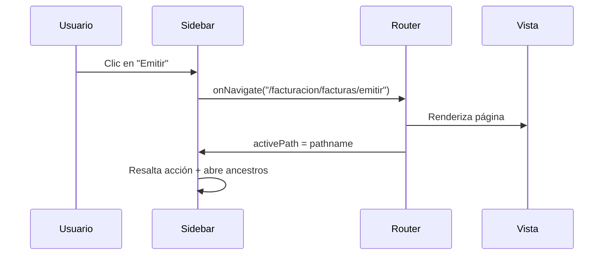

# Integración con routing

El **Sidebar de gluBox no incluye router**. Es agnóstico: expone `activePath` y `onNavigate(path)` para que tu app los conecte con React Router, Next.js App Router, TanStack Router, etc.

## Principio



| Responsabilidad | Componente |
|-----------------|------------|
| Mostrar menú filtrado por RBAC | Sidebar |
| Cambiar URL / historial | Router de la app |
| Resaltar ruta activa | Sidebar (`activePath`) |
| Renderizar pantalla | Router + páginas de la app |
| Validar acceso por URL directa | Guard en la app (recomendado) |

## React Router (v6/v7)

### Hook puente

```tsx
import { useCallback } from 'react';
import { useLocation, useNavigate } from 'react-router-dom';

export function useSidebarNavigation() {
  const navigate = useNavigate();
  const { pathname } = useLocation();

  const onNavigate = useCallback(
    (path: string) => navigate(path),
    [navigate],
  );

  return { activePath: pathname, onNavigate };
}
```

### Layout con Sidebar + Outlet

```tsx
import { useState } from 'react';
import { Outlet } from 'react-router-dom';
import { Sidebar } from 'glubox';
import 'glubox/style.css';

export function AppLayout({ menu, userPermissions, renderIcon, brand }) {
  const [collapsed, setCollapsed] = useState(false);
  const { activePath, onNavigate } = useSidebarNavigation();

  return (
    <div className="app-shell">
      <Sidebar
        menu={menu}
        userPermissions={userPermissions}
        activePath={activePath}
        onNavigate={onNavigate}
        collapsed={collapsed}
        width={collapsed ? 64 : 240}
        onCollapsedChange={setCollapsed}
        collapseOthersOnSelect
        renderIcon={renderIcon}
        brand={brand}
      />
      <main className="app-main">
        <Outlet />
      </main>
    </div>
  );
}
```

### Definición de rutas

Patrón **menú como fuente de verdad**: genera un registro `path → metadatos` desde el mismo `MenuConfig` que usa el Sidebar.

```tsx
import type { MenuConfig, MenuItem, MenuSubItem } from 'glubox';

export interface MenuRoute {
  path: string;
  label: string;
  permissions?: string[];
  breadcrumbs: { label: string; path?: string }[];
}

export function collectMenuRoutes(menu: MenuConfig): Map<string, MenuRoute> {
  const registry = new Map<string, MenuRoute>();

  function walk(
    nodes: (MenuItem | MenuSubItem)[],
    ancestors: { label: string; path?: string }[],
  ) {
    for (const node of nodes) {
      const breadcrumbs = [...ancestors, { label: node.label, path: node.path }];

      if (node.path) {
        registry.set(node.path, {
          path: node.path,
          label: node.label,
          permissions: node.permissions,
          breadcrumbs,
        });
      }

      if (node.children?.length) {
        const next = node.path
          ? breadcrumbs
          : [...ancestors, { label: node.label }];
        walk(node.children, next);
      }
    }
  }

  walk(menu.items, []);
  return registry;
}
```

Referencia en el repo: `src/demo/routing/collectMenuRoutes.ts`.

### Router con resolución dinámica

```tsx
import { BrowserRouter, Navigate, Route, Routes } from 'react-router-dom';

const menuRouteRegistry = collectMenuRoutes(menu);
const defaultPath = '/facturacion/facturas/emitir';

function MenuPage() {
  const { pathname } = useLocation();
  const route = menuRouteRegistry.get(pathname);

  if (!route) return <NotFoundPage />;
  if (!hasPermission(userPermissions, route.permissions)) {
    return <ForbiddenPage />;
  }

  return <PageView route={route} />;
}

export function AppRouter() {
  return (
    <BrowserRouter>
      <Routes>
        <Route path="/" element={<AppLayout />}>
          <Route index element={<Navigate to={defaultPath} replace />} />
          <Route path="*" element={<MenuPage />} />
        </Route>
      </Routes>
    </BrowserRouter>
  );
}
```

Implementación demo completa: carpeta `src/demo/` en el repositorio.

## Guard de permisos

El Sidebar oculta ítems sin permiso, pero **no bloquea URLs escritas a mano**. Repite la validación en la capa de routing:

```tsx
import { hasPermission } from 'glubox';

function RequirePermission({ required, user, children }) {
  if (!hasPermission(user, required)) return <ForbiddenPage />;
  return children;
}
```

En producción, el backend también debe autorizar cada endpoint.

## Mapeo path → componente

El registro del menú da label y permisos; las **vistas** las define tu app:

```tsx
import { lazy } from 'react';

const pages: Record<string, React.LazyExoticComponent<() => JSX.Element>> = {
  '/facturacion/facturas/emitir': lazy(() => import('./pages/EmitirFactura')),
  '/facturacion/facturas/consultar': lazy(() => import('./pages/ConsultarFacturas')),
  '/ajustes': lazy(() => import('./pages/Ajustes')),
};

function MenuPage() {
  const { pathname } = useLocation();
  const route = menuRouteRegistry.get(pathname);
  if (!route) return <NotFoundPage />;

  const Page = pages[pathname];
  if (!Page) return <PageView route={route} />; // placeholder

  return (
    <RequirePermission required={route.permissions} user={userPermissions}>
      <Suspense fallback={null}>
        <Page />
      </Suspense>
    </RequirePermission>
  );
}
```

## Otros routers

### Next.js (App Router)

```tsx
'use client';

import { usePathname, useRouter } from 'next/navigation';

export function SidebarNav(props) {
  const pathname = usePathname();
  const router = useRouter();

  return (
    <Sidebar
      {...props}
      activePath={pathname}
      onNavigate={(path) => router.push(path)}
    />
  );
}
```

### Sin router (estado local)

Solo para prototipos:

```tsx
const [activePath, setActivePath] = useState('/inicio');

<Sidebar activePath={activePath} onNavigate={setActivePath} {...props} />
```

## Sincronización con expansión de menús

| Prop | Efecto al navegar |
|------|-------------------|
| `collapseOnNavigate={false}` (default) | No cierra módulos abiertos; abre ancestros de la nueva ruta si hace falta. |
| `collapseOnNavigate={true}` | Deja abiertos solo los ancestros de la ruta activa. |
| Ítems bottom (`/ajustes`) | Nunca cierran módulos, aunque `collapseOnNavigate` sea true. |

Ver [Sidebar → Comportamiento de expansión](/components/sidebar#comportamiento-de-expansion).

## Checklist routing

- [ ] Todos los `path` del menú tienen ruta o resolución en el router.
- [ ] `activePath` = pathname actual (sin query string, salvo que lo necesites).
- [ ] Redirect de `/` a una ruta por defecto válida.
- [ ] 404 para paths no definidos en el menú.
- [ ] 403 si el usuario no tiene permiso (URL directa).
- [ ] Mismo JSON de menú (o misma fuente) para Sidebar y registro de rutas.

## Probar localmente

```bash
pnpm dev
```

La app demo en `src/demo/` implementa este flujo con React Router.
